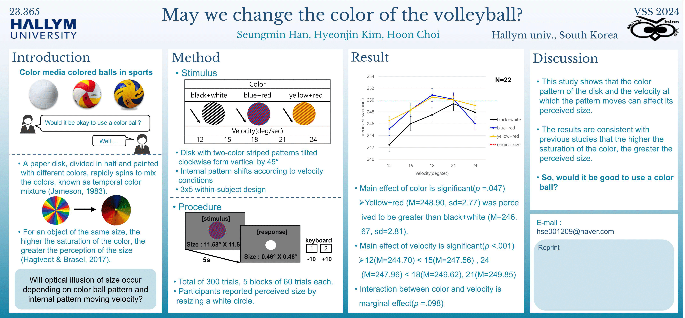

초록

min Han, S., Kim, H., & Choi, H. (2024). May we change the color of the volleyball?. Journal of Vision, 24(10), 472-472.

Color media colored balls in sports. In the past, volleyball games were played with white balls, but FIVB introduced colored balls to activate TV broadcasts. Thus, the colors and patterns applied to the balls are diversifying. Balls with various colors and patterns spinning rapidly can cause color mixing, further creating an optical illusion of size. Volleyball players use their eyes to see the flying ball and their hands to receive it. This harmonious interaction of the body for effective sports performance is called motor coordination. Players in sports that use balls respond to visual stimuli and exert motor coordination skills. However, if optical illusions occur, their visual perception may be distorted, negatively impact performance. Our experiment explored the effects of color and speed on perceived size of balls. The experiment employed a 3x5 within-subject design with color (black+white, blue+red, yellow+red) and speed (36,72,108,144,180 deg/sec) as independent variables, involving 22 adults. The stimuli were circles with two-color striped patterns, tilted clockwise from vertical by 45°. The experiment is total of 300 trials, organized into 5 blocks of 60 trials each. In each trial, participants saw a moving circle with a size of 11.58°x11.58° on the screen. They then reported their perceived size by expanding a 0.46°x0.46° white circle. Repeated Measures 2-way ANOVA analysis revealed a significant main effect of color (p=.047). When the circle had color, it was perceived as larger than when there was no color. The main effect of speed was also significant (p<.001). It showed an inverted U-shaped curve in which the perceived size increased as the speed increased up to 108 deg/sec and then decreased thereafter. The interaction between color and speed showed a marginal effect (p=.098). These results show that the color and speed of a moving ball can influence the perceived size of the ball.

Poster

