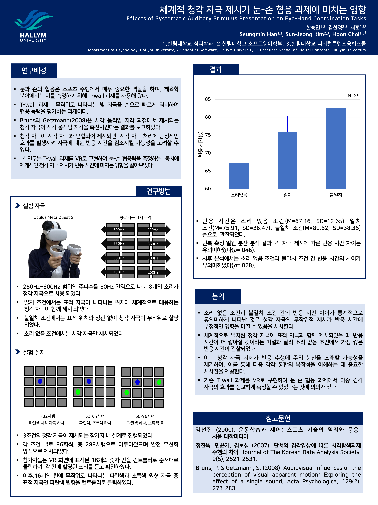

초록
한승민, 김선정, 최훈 (2025, 2월). 체계적 청각 자극 제시가 눈-손 협응 과제에 미치는 영향. 2025년 한국 인지 및 생물 심리학회.

눈과 손의 협응은 스포스 수행에서 매우 중요한 역할을 하며, 체육학 분야에서는 이를 측정하기 위해 T-wall 과제를 사용해 왔다. T-wall 과제는 무작위로 나타나는 빛 자극을 손으로 빠르게 터치하여 협응 능력을 평가하는 과제이다. 본 연구는 T-wall 과제를 VR로 구현하여 눈-손 협응력을 측정하는 동시에 체계적인 청각 자극 제시가 반응 시간에 미치는 영향을 알아보았다. 실험은 3조건의 청각 자극(일치, 불일치, 소리 없음)이 제시되는 참가자 내 설계로 진행되었다. 각 조건별로 96회씩, 총 288회의 시행으로 이루어졌으며 3 수준은 완전 무선화 방식으로 제시되었다. 참가자는 VR 화면을 통해 16개의 칸에 무작위로 나타나는 파란색과 초록색 원형 자극 중 표적 자극인 파란색 원형을 컨트롤러로 클릭하였다. 일치 조건에서는 표적 자극이 나타나는 위치에 체계적으로 대응하는 청각 자극이 함께 제시되었다. 불일치 조건에서는 청각 자극이 표적과 함께 제시되었으나, 표적 위치와 상관없이 무작위로 할당되었다. 사용된 청각 자극은 250Hz에서 600Hz 범위의 주파수를 50Hz 간격으로 나눈 총 8개의 소리였다. 16개의 칸을 2개씩 묶어 8개의 구역으로 구분하였으며 각 구역에는 하나의 청각 자극이 할당되었다. 소리 없음 조건에서는 시각 자극만 제시되었다. 실험 결과, 반응 시간은 소리 없음 조건(M=67.16, SD=12.65), 일치 조건(M=75.91, SD=36.47), 불일치 조건(M=80.52, SD=38.36) 순으로 관찰되었다. 반복 측정 일원 분산분석 결과, 청각 자극 제시에 따른 반응 시간 차이는 유의미하였다(p=.046). 사후 분석에서는 소리 없음 조건과 불일치 조건 간 반응 시간의 차이가 유의미하였다(p=.028). 본 연구는 전형적인 T-wall 과제를 VR로 구현한 과제에서 청각 자극의 효과를 확인하였다는 데에 의의가 있다.

주제어: 눈-손 협응력, 반응 시간, VR, 다중 감각

Poster

