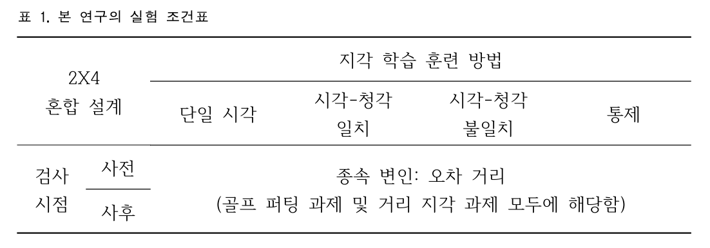
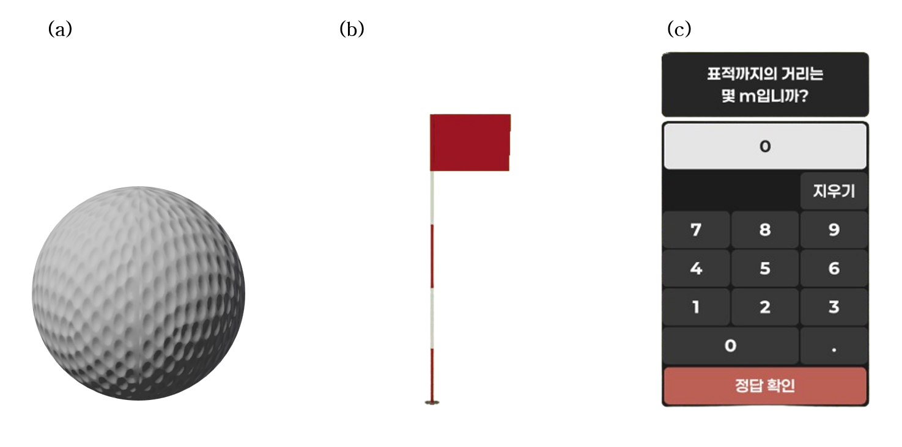

실험 조건: 본 연구는 검사 시점[사전/사후]을 참가자 내 변인으로, 지각 학습 훈련 방법[단일 시각 조건/시각-청각 일치/시각-청각 불일치/통제]을 참가자 간 변인으로 한 2X4 혼합 설계이다.

절차: 본 연구는 총 7일 동안 사전검사 1회기, 훈련 5회기, 사후검사 1회기의 순서로 구성되었으며 전 회기에서 동일한 자극 구성이 유지되었다.

자극: 

