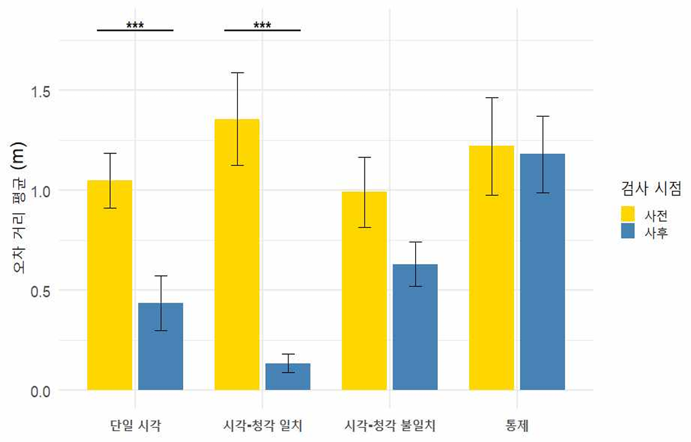
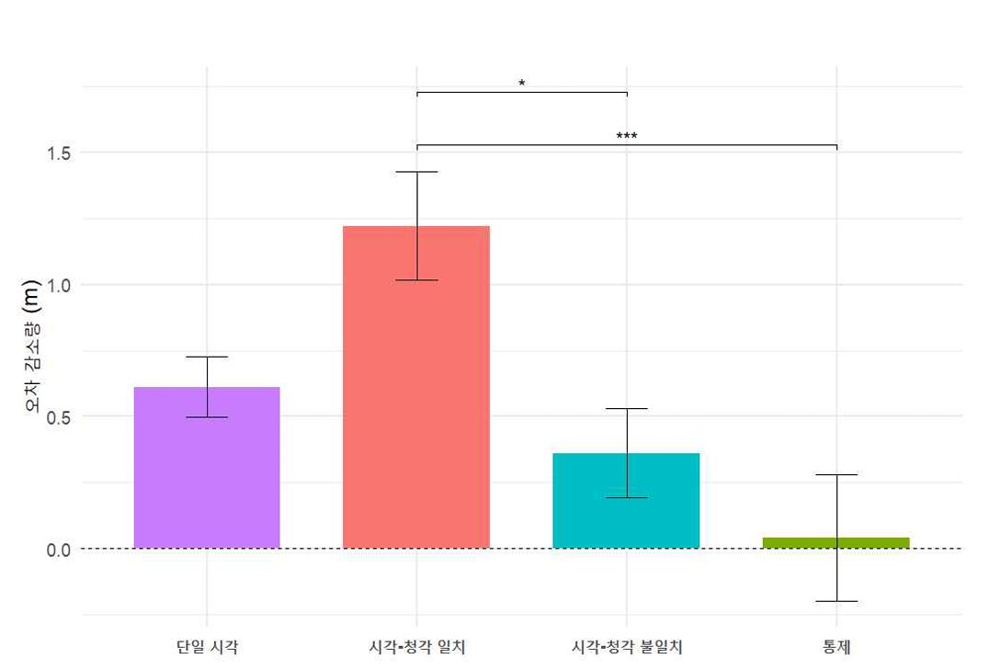
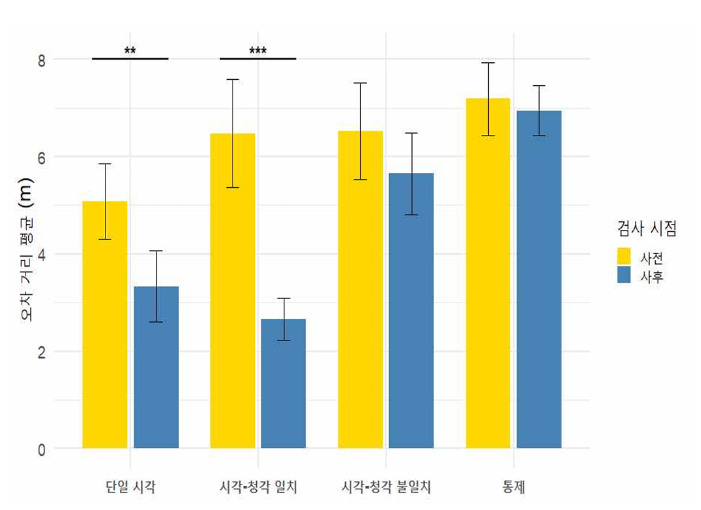
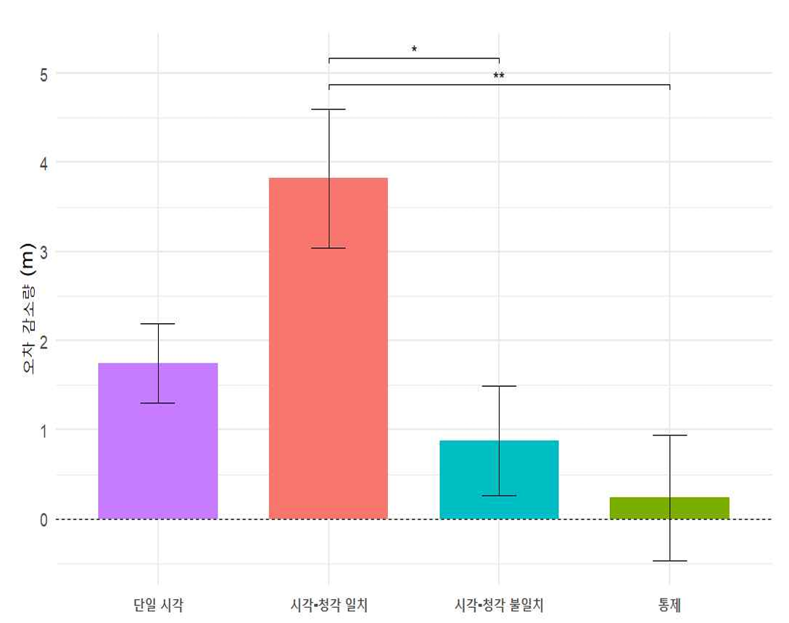

 1. 검사 시점 및 지각 학습 훈련 방법에 따른 거리 지각 과제 오차 거리 평균(***p<.001).

 2. 지각 학습 훈련 방법에 따른 거리 지각 학습 효과(***p<.001, *p<.05).

 4. 검사 시점 및 지각 학습 훈련 방법에 따른 골프 퍼팅 과제 오차 거리 평균 (***p<.001, **p<.01).

 6. 지각 학습 훈련 방법에 따른 골프 퍼팅 과제에서의 학습 효과(**p<.01, *p<.05).

